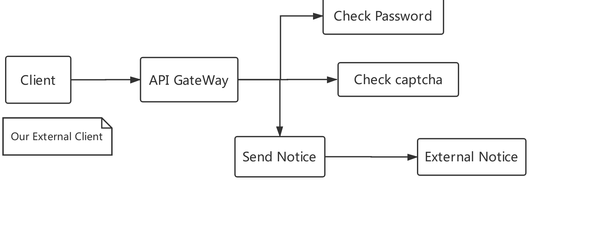

# dccn-tools

## Introduce

**protoc-gen-ankr**

​     This is a protobuffer code generation tool based on the actual needs of ankr. It is a secondary development based on the official protoc-gen-go code generation tool. It adds log tracking content and some usage optimizations, such as client calls, etc....

**logger**

​     The log package is based on the secondary encapsulation of the Uber's zap log package to meet the needs of Ankr distributed log tracking. Of course, in the log output, we add a lot of new elements, such as service name, host name, information type, etc.

**zap**

​		This package is used to output system log

**snowflake**

​		This package is used to generate the ordered id

**metadata**

​		it is used to transit some information between one service and the other service

**parse-overview**
        
​		This package is used to parse Overview.yaml in the chart

## Example

​		the example architect , as show below:

example source  code is here.

